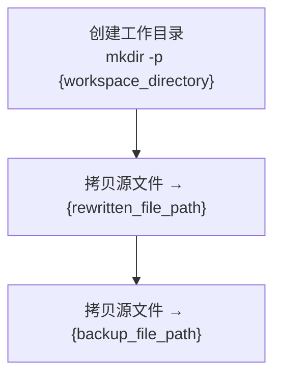
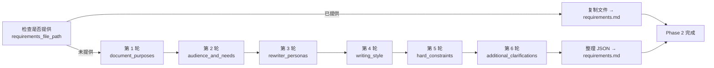
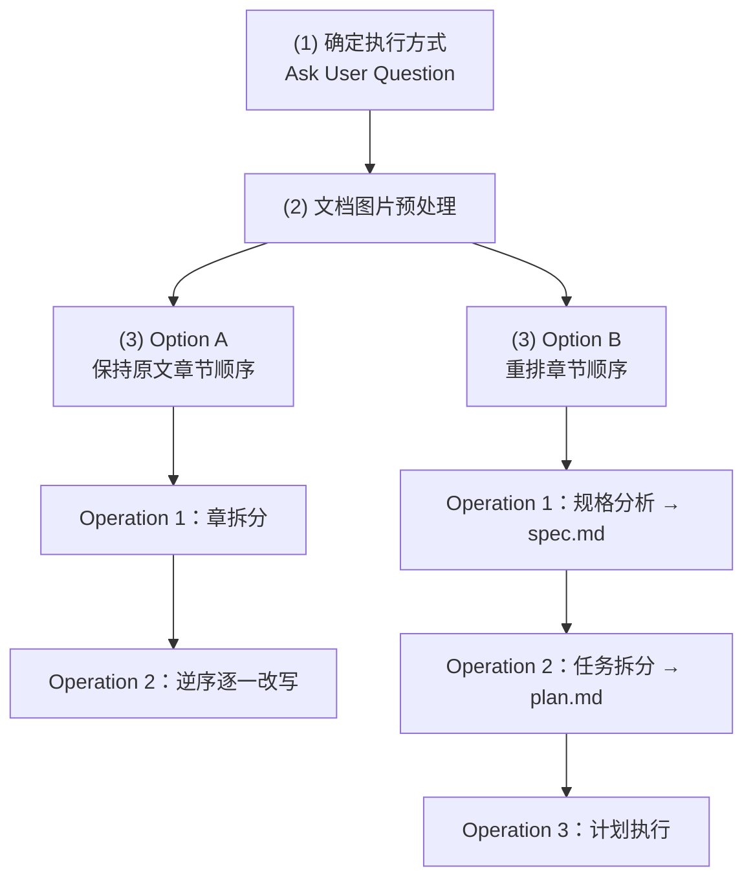
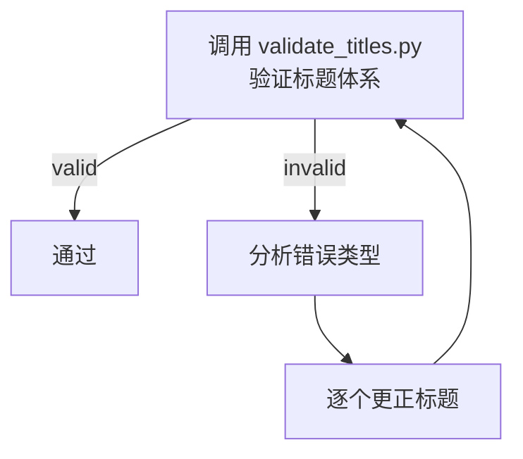

# Markdown 文档改写 Skill

本 Skill 通过四阶段流程将用户提供的 Markdown 文档改写为高质量版本：


## 输入参数

Skill 接收以下输入参数：

| 参数 | 类型 | 必填 | 默认值 | 说明 |
|------|------|------|--------|------|
| `source_file_path` | string | 是 | - | 源 Markdown 文件的路径 |
| `initial_requirements` | string | 否 | "" | 用户对改写结果的初始需求 |
| `requirements_file_path` | string | 否 | "" | 现有需求文件的路径（若提供则跳过 Phase 2） |
| `test_mode` | boolean | 否 | false | 测试模式：使用预设需求跳过 6 轮交互，仅用于自动化测试 |

## System Rules（最高优先级）

System Rules 定义了 Skill 执行过程中不可逾越的边界条件，对主 Agent 和所有 Sub Agent 均有效。

### 1. 源文件只读

严禁以任何方式修改 `source_file_path` 所指的源文件。

**设计动机**：源文件是改写的唯一真实来源（single source of truth）。改写过程会产生大量中间状态，若源文件被意外修改，将无法回溯原始内容，破坏改写的可追溯性和可重复性。

### 2. 四级标题体系

改写文件中所有章节标题必须严格遵循四级标题体系，不允许超出这四个层级。

详细规范请参考 `references/title-system.md`。

**设计动机**：统一的标题层级保证改写文档的结构一致性。Skill 的改写流程会将文档拆分到多个 Sub Agent 并行处理，只有严格的标题规范才能确保各章节独立改写后仍能无缝拼合。

### 3. 工作区目录

Skill 运行期间生成的文件分为两类：

1. **输出文件**：改写副本存放在源文件同目录下，备份存放在工作区目录下
2. **中间产物**：所有运行期间生成的其他文件必须且只能存放在 `{workspace_directory}` 目录下

**路径推导**：

```python
# 假设 source_file_path = "./tech_note/codex.md"
source_file_dir = "./tech_note/"           # 源文件所在目录
source_file_name = "codex"                 # 源文件名（不含扩展名）
workspace_directory = "./tech_note/workspace/codex/"  # 工作区目录
rewritten_file_path = "./tech_note/codex_rewritten.md"  # 改写文件
backup_file_path = "./tech_note/workspace/codex/codex_backup.md"  # 备份文件
```

**设计动机**：改写副本放在源文件同目录下，确保文档中基于相对路径的图片和 Wiki-link 引用不会因目录变更而失效。备份存放在工作区目录，与中间产物一起管理，避免污染用户文件系统。

## 四阶段执行流程

### Phase 1: 准备工作环境

创建工作目录并初始化改写文件。



**执行方式**：调用 `scripts/setup_workspace.py` 脚本。

```bash
python scripts/setup_workspace.py <source_file_path>
```

该脚本会：
1. 验证源文件存在且可读
2. 创建工作目录
3. 创建改写副本和备份
4. 返回所有路径变量

### Phase 2: 需求澄清

此 Phase 在**独立上下文的 Sub Agent** 中执行，目标是通过 6 轮提问澄清需求并将结果持久化到 `requirements.md`。



#### 前置检查

检查用户是否提供了 `requirements_file_path` 参数：
- **若已提供**：直接复制该文件到 `requirements.md`，跳过 6 轮需求澄清
- **若未提供**：继续执行 6 轮需求澄清流程

#### 6 轮需求澄清流程

每一轮都使用 **AskUserQuestion** 工具向用户提问。

| 轮次 | 澄清问题 | 是否多选 | 对应变量 | 示例答案 |
|------|----------|----------|----------|----------|
| 1 | 改写后的文档将用于哪些场景？ | **强制多选** | `document_purposes` | 技术培训、向技术经理介绍 |
| 2 | 改写后的文档面向哪些读者？他们各自的核心诉求是什么？ | **强制多选** | `audience_and_needs` | 程序员（学习技术）、技术经理（了解价值） |
| 3 | 改写时应扮演什么角色身份？该角色擅长什么？ | **强制多选** | `rewriter_personas` | 资深架构师、擅长技术可视化 |
| 4 | 改写后的文档应采用怎样的表达风格？ | **强制多选** | `writing_style` | 用词精炼、使用图表展示 |
| 5 | 改写过程中有哪些不可违反的硬性规则？ | **强制多选** | `hard_constraints` | 代码完整保留、操作步骤不省略 |
| 6 | 还有其他需要澄清的问题吗？ | **强制多选** | `additional_clarifications` | 命令输出保留在 code block |

**备选答案生成策略（强制多选）**：每一轮提问时，Sub Agent **必须**使用 AskUserQuestion 工具，**强制设置** `multiSelect: true`，允许用户选择多个备选答案。Sub Agent 基于对 `initial_requirements` 和源文件内容的理解，结合前几轮用户的回答，生成该轮可能性最高的若干备选答案，按可能性从高到低排列，与问题一起提供给用户。用户可多选、也可打字补充。

**测试模式**：当 `test_mode=true` 时，跳过 6 轮 AskUserQuestion 交互，直接使用预设的默认需求生成 `requirements.md`。预设需求如下：

```json
{
  "document_purposes": {
    "clarification_question": "改写后的文档将用于哪些场景？",
    "answers": ["测试验证", "演示 Skill 功能"]
  },
  "audience_and_needs": {
    "clarification_question": "改写后的文档面向哪些读者？他们各自的核心诉求是什么？",
    "answers": ["测试人员，验证 Skill 功能正确性"]
  },
  "rewriter_personas": {
    "clarification_question": "改写时应扮演什么角色身份？该角色擅长什么？",
    "answers": ["测试助手，严格按照规格执行"]
  },
  "writing_style": {
    "clarification_question": "改写后的文档应采用怎样的表达风格（行文风格、内容深度、表达调性等）？",
    "answers": ["保持原有风格，仅验证结构和流程正确性"]
  },
  "hard_constraints": {
    "clarification_question": "改写过程中有哪些不可违反的硬性规则？",
    "answers": ["遵守四级标题体系", "源文件只读", "工作区目录隔离"]
  },
  "additional_clarifications": {
    "clarification_question": "还有其他需要澄清的问题吗？",
    "answers": []
  }
}
```

**结果持久化**：将各轮的问题和用户回答（或测试模式的预设需求）整理为 JSON，保存至 `{workspace_directory}/requirements.md`。

#### Sub Agent 执行指南

Phase 2 应在一个**独立上下文的 Sub Agent** 中执行：

```
Sub Agent 指令：
1. 阅读 source_file_path 和 initial_requirements（如有）
2. 检查是否提供 requirements_file_path
3. 若未提供，通过 6 轮 AskUserQuestion 澄清需求，**每一轮都必须设置 multiSelect: true，强制支持多选**
4. 将结果保存为 JSON 格式到 requirements.md
5. 报告完成
```

### Phase 3: 文档改写

此 Phase 在**独立上下文的 Sub Agent** 中执行，包含三个子步骤。详细执行路径说明请参考 `references/phase3-operations.md`。



#### 步骤 1: 确定执行方式

通过 **AskUserQuestion** 询问用户"是否保持原文的章节顺序"，备选答案为"是"和"否"。

- 选择"是"：进入 **Option A**
- 选择"否"：进入 **Option B**

#### 步骤 2: 文档图片预处理

在每张图片下方添加 Markdown 注释，记录图片路径、用途和内容描述。

**执行方式**：
1. **Step 1 — 定位图片**：找到并记录每张图片的位置，生成处理计划
2. **Step 2 — 逆序添加注释**：按从下到上的逆序，为每张图片创建一个独立 Sub Agent 添加注释

**逆序执行动机**：先处理后面的图片不会改变前面图片的位置，便于后续处理。

**注释格式**：
```html
<!-- 
图片内容说明
路径：{图片文件路径}
用途：{推测出来的图片用途}
内容：{提炼出的图片内容说明}
-->
```

**图片格式识别**：
- Wiki-link: `![[{图片文件路径}]]`
- 标准 Markdown: ``
- HTML: ``

#### 步骤 3: 文档重写

根据用户选择，进入 Option A 或 Option B。

---

##### Option A: 保持原文章节顺序

**适用场景**：原文的章节组织合理，只需优化各章内容。

**Operation 1: 章拆分**

由独立 Sub Agent 完成章节划分。使用第一性原理思考如何划分章节能帮助读者：
1. 确定文档的主题边界与覆盖范围
2. 建立主题之间的逻辑关系
3. 为不同读者提供最粗粒度的导航入口

**Operation 2: 逆序逐一改写**

由调度 Sub Agent 管理，按**从下到上逆序**为每章创建独立 Sub Agent 执行改写。

**逆序动机**：避免后续章节改写时上下文漂移导致前面章节风格不一致。

**各章 Sub Agent 执行两步**：
1. **Step 1 — 产出规格**：结合本章内容和需求，判断如何改写，保存至 `spec_{chapter_number}.md`。规格须包含**写作结构方案**（如因果递进、问题驱动、概念分层、结论先行等）。
2. **Step 2 — 执行改写**：参考规格完成改写。可参考图片注释理解图片内容。

---

##### Option B: 重排章节顺序

**适用场景**：原文的章节组织需要重组，可能涉及合并、拆分、重排。

以下三个操作在**独立上下文的 Sub Agent** 中串行执行：

**Operation 1: 改写结果规格分析**

1. 用第一性原理思考：要达成需求，文档应改写成什么样子？
2. 保存规格至 `spec.md`
3. **审慎原则**：若目标不清晰，停下来与用户讨论

**Operation 2: 任务拆分与计划制定**

1. 以 `spec.md` 为准，制定执行计划
2. 计划分为若干步骤，每步包含规格说明与执行过程
3. 规格说明须包含**写作结构方案**
4. 保存计划至 `plan.md`

**Operation 3: 计划执行**

1. 参考 `spec.md` 和 `plan.md`，逐一执行步骤
2. 每个步骤使用独立 Sub Agent 执行

---

#### 并发控制规则

Phase 3 中可能同时拆分出多个 Sub Agent。为避免触发 API 并发度限制，多个 Sub Agent 必须 **2 个 2 个地分配运行**——即同时最多 2 个 Sub Agent 在执行，待其中一组完成后再启动下一组。

#### Sub Agent 执行指南

Phase 3 应在一个**独立上下文的 Sub Agent** 中执行：

```
Sub Agent 指令：
1. 阅读 rewritten_file_path、requirements.md 和 initial_requirements
2. 通过 AskUserQuestion 确定执行方式（Option A 或 B），设置 multiSelect: false（单选）
3. 执行文档图片预处理
4. 根据用户选择，进入 Option A 或 Option B
5. 遵守并发控制规则：2 个 Sub Agent 一组执行
6. 完成后报告改写完成
```

### Phase 4: 质量检查

此 Phase 在**独立上下文的 Sub Agent** 中执行，目标是验证改写文件的质量，目前实现标题体系验证。



#### 步骤 1: 验证标题体系

调用 `scripts/validate_titles.py` 脚本验证改写文件是否符合四级标题体系规范。

```bash
python scripts/validate_titles.py {rewritten_file_path}
```

验证脚本检查以下问题：

**P0 检测（必须通过）**：
- **P0-1 格式问题**（error）：前缀、编号、空格、内容是否符合规范
- **P0-2 越级使用**（error）：标题是否跳跃层级（如 Level 1 → Level 3）
- **编号递增错误**（error/warning）：各级编号是否正确递增
- **超出四级**（error）：是否使用了 Level 5+
- **父子关系错误**（error）：Level 2 的父级编号是否匹配

**P1 检测（建议通过）**：
- **P1-3 编号顺序混乱**（warning）：编号出现顺序是否正确（如 `### 1.3` 在 `### 1.2` 之前）
- **P1-4 空标题**（warning）：标签后是否有内容

验证脚本返回 JSON 格式的结果：

```json
{
  "valid": true/false,
  "errors": [
    {
      "line": int,
      "type": str,           # "format" | "skip_level" | "increment" | "overflow" | "parent_mismatch"
      "level": str,          # "Level 1" | "Level 2" | ...
      "message": str,
      "severity": str        # "error"
    }
  ],
  "warnings": [
    {
      "line": int,
      "type": str,           # "order" | "empty"
      "level": str,          # "Level 2" | "Level 3" | ...
      "message": str,
      "severity": str        # "warning"
    }
  ],
  "title_count": {
    "level_1": int,
    "level_2": int,
    "level_3": int,
    "level_4": int
  },
  "summary": {
    "total_errors": int,
    "total_warnings": int,
    "error_by_type": {...}
  }
}
```

#### 步骤 2: 更正（仅当验证失败时）

如果验证失败（`valid != true` 或存在 error 级别的错误），启动一个独立 Sub Agent 分析错误并逐个更正。

**更正策略**：

1. 解析验证脚本返回的 `errors` 和 `warnings` 列表
2. 按优先级处理错误：
   - **P0 级别（error）必须修复**：格式、越级、递增、超出四级、父子关系
   - **P1 级别（warning）建议修复**：顺序、空标题
3. 对于每个错误，识别错误类型并更正：
   - **格式错误**：修正编号格式（如 `### 1.1背景` → `### 1.1 背景`）
   - **越级使用**：插入缺失的中间层级标题
   - **编号递增错误**：重新编号标题
   - **超出四级**：降级到 Level 4 或调整结构
   - **空标题**：补充标题内容或删除空标题
   - **编号顺序混乱**：调整标题顺序
4. 修复后重新验证，直到 `valid == true` 或达到最大迭代次数（建议 5 次）

#### 并发控制

此 Phase 不涉及并发，只需单 Sub Agent 串行执行。

#### Sub Agent 执行指南

Phase 4 应在一个**独立上下文的 Sub Agent** 中执行：

```
Sub Agent 指令：
1. 调用 validate_titles.py 验证 rewritten_file_path
2. 如果 valid == true 且无 error 级别错误，报告质量检查通过
3. 如果验证失败：
   a. 分析 errors 和 warnings 列表
   b. 按优先级逐个更正（P0 > P1）
   c. 修复后重新验证
   d. 重复直到 valid == true 或达到最大迭代次数
4. 报告最终结果（通过/失败及错误详情）
```

## 总结

本 Skill 的核心设计原则：

1. **四阶段分离**：准备 → 澄清 → 执行 → 质量检查，职责边界清晰
2. **Sub Agent 拆分**：避免上下文窗口耗尽，每个 Agent 专注当前阶段
3. **System Rules 最高优先级**：源文件只读、四级标题体系、工作区隔离
4. **逆序执行策略**：在图片预处理和章节改写中使用逆序，避免位置漂移
5. **并发控制**：2 个 Sub Agent 一组执行，避免 API 并发限制
6. **质量保证**：Phase 4 自动验证标题体系，确保改写文档符合规范
