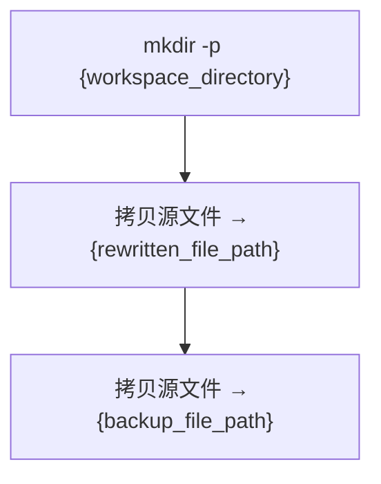
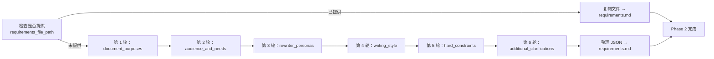
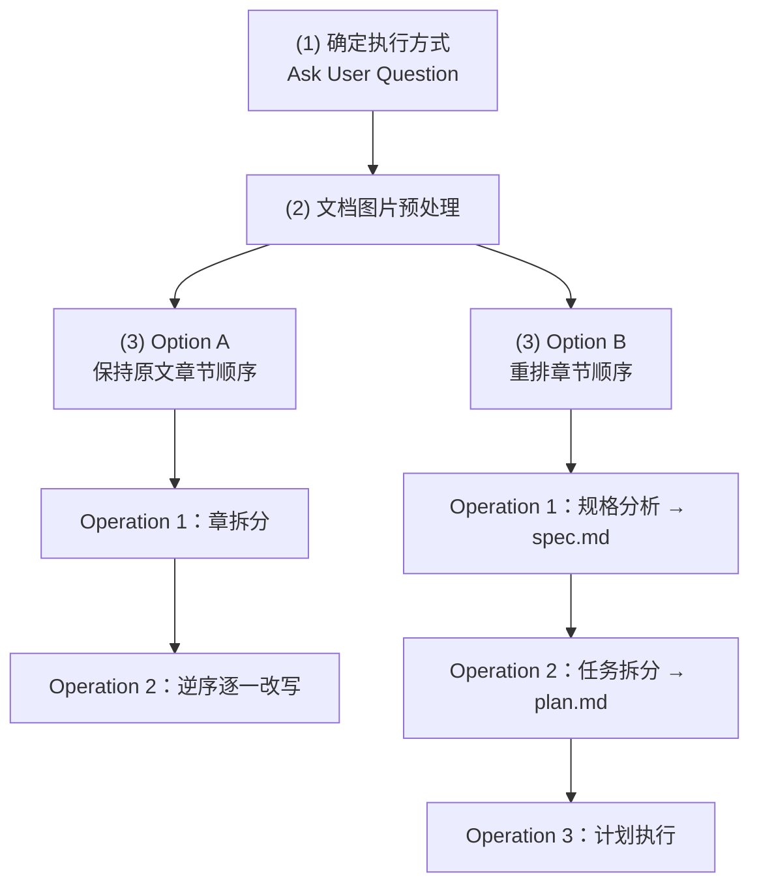

## 1. Usage

### 1.1 概述

本 Skill 接收一份用户提供的 Markdown 文档，通过三阶段流程生成一份高质量改写文档：Phase 1 准备工作环境，Phase 2 通过 6 轮交互澄清改写需求，Phase 3 按需改写文档内容。


设计动机：将改写拆分为"准备 → 澄清 → 执行"三个独立阶段，使每个阶段的职责边界清晰——Phase 2 专注理解用户意图，Phase 3 专注执行改写，互不干扰。各阶段在独立上下文的 Sub Agent 中运行，避免单次改写的上下文窗口耗尽问题。

### 1.2 输入参数

Skill 接收两个输入参数，精确规格定义如下：

```json
{
  "skill_parameters": {
    "source_file_path": {
      "type": "string",
      "required": true,
      "description": "用户提供的源 Markdown 文件的路径、也是 Skill 生成的改写文件的内容来源",
      "example": "./tech_note/codex.md"
    },
    "initial_requirements": {
      "type": "string",
      "required": false,
      "default": "",
      "description": "用户对改写结果的初始需求，以自然语言描述，如重点方向、风格偏好、特殊要求等。若未提供，则由 Skill 自行判断改写策略"
    },
    "requirements_file_path": {
      "type": "string",
      "required": false,
      "default": "",
      "description": "用户提供的现有需求文件的路径。若提供，则跳过 Phase 2 的 6 轮澄清，直接将文件内容复制到 {workspace_directory}/requirements.md",
      "example": "./tech_note/requirements.md"
    }
  }
}
```

#### (1) source_file_path

源文件的绝对或相对路径。该文件是改写内容的唯一来源（single source of truth），Skill 在整个生命周期中不会修改它——所有改写操作都在源文件同目录下的副本（`{rewritten_file_path}`）上进行。

#### (2) initial_requirements

用户对改写结果的初始意图，以自然语言描述。当用户已有明确方向时，提供此参数可引导 Phase 2 的需求澄清更聚焦；当用户从零开始时，可留空，Phase 2 会通过 6 轮交互逐步引导用户澄清所有需求维度。

## 2. System Rules

System Rules 定义了 Skill 执行过程中不可逾越的边界条件。它们拥有最高优先级——任何执行阶段的逻辑都不得覆盖或违反这些约束，且约束对主 Agent 和执行期间产生的所有 Sub Agent 均有效。

本文档中以 `{system_rules}` 引用时，指代本章节定义的全部规则（§2.1、§2.2、§2.3）。

以下三条规则分别约束 Skill 的输入（源文件只读）、输出结构（四级标题体系）和中间产物（工作区目录隔离）。

### 2.1 源文件只读（source_file_restriction）

严禁以任何方式修改 "{source_file_path}" 所指的源文件。

**设计动机**：源文件是改写的唯一真实来源（single source of truth）。改写过程会产生大量中间状态，若源文件被意外修改，将无法回溯原始内容，改写的可追溯性和可重复性都会被破坏。因此源文件在整个 Skill 生命周期中必须保持只读。

禁止的操作包括但不限于：写入、追加、覆盖、删除内容。

### 2.2 四级标题体系（title_restriction）

改写文件中所有章节标题必须严格遵循以下四级标题体系，不允许超出这四个层级，每个层级的标题编号必须按照下方规格编写。

**设计动机**：统一的标题层级保证改写文档的结构一致性。Skill 的改写流程会将文档拆分到多个 Sub Agent 并行处理，只有严格的标题规范才能确保各章节独立改写后仍能无缝拼合，不会出现层级冲突或编号错乱。

精确规格定义如下，开发者在实现标题编号逻辑时应逐字段对照：

```json
{
  "levels": [
    {
      "level": 1,
      "name": "章",
      "markdown_prefix": "##",
      "numbering_pattern": "阿拉伯数字递增",
      "format": "## {n}. ",
      "example": "## 1. "
    },
    {
      "level": 2,
      "name": "节",
      "markdown_prefix": "###",
      "numbering_pattern": "父级.子级递增",
      "format": "### {n}.{m} ",
      "example": "### 1.1 "
    },
    {
      "level": 3,
      "name": "小节",
      "markdown_prefix": "####",
      "numbering_pattern": "圆括号阿拉伯数字递增",
      "format": "#### ({k}) ",
      "example": "#### (1) "
    },
    {
      "level": 4,
      "name": "段落条目",
      "markdown_prefix": "#####",
      "numbering_pattern": "带圈数字递增",
      "format": "##### {circled_n} ",
      "example": "##### ① "
    }
  ]
}
```

附加规则：

- 不允许超出以上四个层级
- 每个层级的标题编号必须按 `levels` 中的定义编写

### 2.3 工作区目录（workspace_directory_restriction）

Skill 运行期间生成的文件分为两类，各有存放位置约束：

1. **输出文件**：改写副本（`{rewritten_file_path}`）和原始备份（`{backup_file_path}`）存放在源文件同目录下（`{source_file_dir}`），以保持源文件中的相对路径（图片、文档引用等）始终有效。
2. **中间产物**：除上述输出文件外，其余所有运行期间生成的文件（如 requirements.md、spec.md、plan.md 等）必须且只能存放在 "{workspace_directory}" 目录下。

**设计动机**：改写副本和备份放在源文件同目录下，确保文档中基于相对路径的图片和 Wiki-link 引用不会因目录变更而失效。中间产物隔离到独立的工作区目录，避免污染用户文件系统，且清理和归档简单——只需处理一个目录。

#### (1) 路径推导规则

所有路径变量由用户输入的 "{source_file_path}" 推导得出，推导步骤如下：


| 变量                      | 推导方式                                                               | 示例                               |
| ----------------------- | ------------------------------------------------------------------ | -------------------------------- |
| "{source_file_path}"    | 用户输入的源文件完整路径                                                       | "./tech_note/codex.md"           |
| "{source_file_dir}"     | 取 "{source_file_path}" 的父目录                                        | "./tech_note/"                   |
| "{source_file_name}"    | 取 "{source_file_path}" 的文件名部分（不含扩展名）                               | "codex"                          |
| "{workspace_directory}" | 拼接："{source_file_dir}" + "workspace/" + "{source_file_name}" + "/" | "./tech_note/workspace/codex/"   |
| "{rewritten_file_path}" | 拼接："{source_file_dir}" + "{source_file_name}" + "_rewritten.md"    | "./tech_note/codex_rewritten.md" |
| "{backup_file_path}"    | 拼接："{source_file_dir}" + "{source_file_name}" + "_backup.md"       | "./tech_note/codex_backup.md"    |


路径模板：


| 变量                      | 路径模板                                                |
| ----------------------- | --------------------------------------------------- |
| "{workspace_directory}" | "{source_file_dir}/workspace/{source_file_name}/"   |
| "{rewritten_file_path}" | "{source_file_dir}/{source_file_name}_rewritten.md" |
| "{backup_file_path}"    | "{source_file_dir}/{source_file_name}_backup.md"    |


#### (2) 推导示例

以 "{source_file_path}" = "./tech_note/codex.md" 为例：

- "{source_file_dir}" = "./tech_note/"
- "{source_file_name}" = "codex"
- "{workspace_directory}" = "./tech_note/workspace/codex/"
- "{rewritten_file_path}" = "./tech_note/codex_rewritten.md"
- "{backup_file_path}" = "./tech_note/codex_backup.md"

## 3. Execution Process

### 3.1 Overview

#### (1) 执行流程

整个 Skill 的执行流程分为三个阶段，严格串行：


#### (2) 运行机制

##### ① 设计动机：Sub Agent 拆分策略

Phase 2 和 Phase 3 均在独立上下文的 Sub Agent 中执行。原因：每个 Phase 都需要读取完整源文件并与用户多轮交互或执行大量改写操作，若全部在主 Agent 中运行，上下文窗口会迅速耗尽。拆分为独立 Sub Agent 后，每个 Agent 只需关注当前阶段的任务，上下文利用率最优。

##### ② 并发控制规则

Phase 3 中可能同时拆分出多个 Sub Agent。为避免触发大模型 API 并发度限制，多个 Sub Agent 必须 **2 个 2 个地分配运行**——即同时最多 2 个 Sub Agent 在执行，待其中一组完成后再启动下一组。

### 3.2 Phase 1 - Preparation

准备工作：创建工作目录并初始化改写文件。




#### (1) 创建工作目录

创建 "./{workspace_directory}"，使用 `mkdir -p` 语义确保目录已存在时不报错。

#### (2) 初始化改写文件

将 "{source_file_path}" 的内容拷贝到 "{rewritten_file_path}"。后续所有改写操作都在此文件上进行。

#### (3) 创建备份

将 "{source_file_path}" 的内容拷贝到 "{backup_file_path}"，保留原始副本以供回溯。

### 3.3 Phase 2 - Requirement Clarification

此 Phase 在独立上下文的 Sub Agent 中执行，目标是通过需求澄清并将结果持久化到 `{workspace_directory}/requirements.md`。

Phase 2 通过 6 轮提问澄清需求。



#### (1) 前置检查：是否已提供需求文件

检查用户是否提供了 `{requirements_file_path}` 参数：

- **若已提供**：直接将该文件的内容复制到 `{workspace_directory}/requirements.md`，跳过后续 6 轮需求澄清，Phase 2 完成。
- **若未提供**：继续执行 6 轮需求澄清流程（以下步骤 2-7）。

**设计动机**：支持用户复用已有的需求规格文件，避免重复澄清相同的需求维度，提升改写效率。用户可能在之前的改写中已经明确了需求，或者有预定义的需求模板，直接复用可节省时间。

#### (2) 6 轮需求澄清流程（仅当未提供 requirements_file_path 时执行）

##### ① 需求维度澄清

Sub Agent 分析 `{initial_requirements}` 和 "{source_file_path}" 的文件内容后，通过 6 轮 Ask User Question 逐一澄清以下需求维度：


| 轮次  | 澄清问题                               | 是否多选 | 是否必填 | 对应变量                        | 示例                                                                       |
| --- | ---------------------------------- | ---- | ---- | --------------------------- | ------------------------------------------------------------------------ |
| 1   | 改写后的文档将用于哪些场景？                     | **强制多选** | 容许为空 | `document_purposes`         | `["技术培训", "向技术经理介绍该技术"]`                                                 |
| 2   | 改写后的文档面向哪些读者？他们各自的核心诉求是什么？         | **强制多选** | 容许为空 | `audience_and_needs`        | `["程序员，学习文档中的技术", "技术经理，了解技术价值、应用场景、选型和架构"]`                             |
| 3   | 改写时应扮演什么角色身份？该角色擅长什么？              | **强制多选** | 容许为空 | `rewriter_personas`         | `["资深架构师、逻辑清晰、擅长技术可视化、深入浅出", "Java 分布式技术栈培训师、精通中间件、重视实操"]`               |
| 4   | 改写后的文档应采用怎样的表达风格（行文风格、内容深度、表达调性等）？ | **强制多选** | 容许为空 | `writing_style`             | `["用词精炼但内容充实", "适合图表的部分用 mermaid 或 ASCII chart 表示"]`                     |
| 5   | 改写过程中有哪些不可违反的硬性规则？                 | **强制多选** | 容许为空 | `hard_constraints`          | `["代码必须格式化放在 code block 中、完整保留", "行文风格参考 @./tech_doc/sector_sample.md"]` |
| 6   | 还有其他需要澄清的问题吗？                      | **强制多选** | 容许为空 | `additional_clarifications` | `["命令和终端输出放在 text code block 中完整保留"]`                                    |


##### ② 备选答案生成策略（强制多选）

每一轮提问时，Sub Agent **必须**使用 AskUserQuestion 工具，**强制设置** `multiSelect: true`，允许用户选择多个备选答案。Sub Agent 基于对 `{initial_requirements}` 和源文件内容的理解，结合前几轮用户的回答，生成该轮可能性最高的若干备选答案，按可能性从高到低排列，与问题一起提供给用户。用户可多选、也可打字补充。

##### ③ 结果持久化

所有轮次完成后，将各轮的问题和用户回答整理为 JSON，保存至 "{workspace_directory}/requirements.md"。

格式如下：

```json
{
  "document_purposes": {
    "clarification_question": "改写后的文档将用于哪些场景？",
    "answers": ["程序员技术培训", "向技术经理介绍该技术"]
  },
  "audience_and_needs": {
    "clarification_question": "改写后的文档面向哪些读者？他们各自的核心诉求是什么？",
    "answers": ["程序员，学习文档中的技术", "技术经理，了解技术价值、应用场景、选型和架构"]
  },
  "rewriter_personas": {
    "clarification_question": "改写时应扮演什么角色身份？该角色擅长什么？",
    "answers": ["资深架构师、逻辑清晰、擅长技术可视化、深入浅出、发现技术价值", "Java分布式技术栈培训师、精通中间件技术、重视实操、擅长编写教学文稿"]
  },
  "writing_style": {
    "clarification_question": "改写后的文档应采用怎样的表达风格（行文风格、内容深度、表达调性等）？",
    "answers": ["用词精炼但内容充实", "适合使用图表展示的部分、用mermaid或ascii chart来表示"]
  },
  "hard_constraints": {
    "clarification_question": "改写过程中有哪些不可违反的硬性规则？",
    "answers": ["代码必须格式化放在code block中、然后完整保留", "操作步骤要介绍清楚、不能省略或简单概括"]
  },
  "additional_clarifications": {
    "clarification_question": "还有其他需要澄清的问题吗？",
    "answers": ["提问：操作时的命令和终端输出是否保留？ 用户回答：是的保留，放在text类型的code block中、格式化后完整保留"]
  }
}
```

### 3.4 Phase 3 - Document Rewrite

此 Phase 在独立上下文的 Sub Agent 中执行，包含三个子步骤：(1) 确定执行方式、(2) 文档图片预处理、(3) 文档重写。Skill 可自行判断是否需要进一步拆分子任务到更多 Sub Agent 中，但须遵守 3.1 中定义的并发控制规则。

Phase 3 整体流程如下：




#### (1) 确定执行方式

通过 Ask User Question 询问用户"是否保持原文的章节顺序"，备选答案为"是"和"否"。

#### (2) 文档图片预处理

在每张图片下方使用 Markdown 注释，记录图片路径、推测的图片用途和图片内容描述，为后续改写步骤提供辅助信息。

##### ① 执行过程

启动一个拥有独立上下文的 Sub Agent 负责预处理任务调度，过程如下：

- **Step 1 — 定位图片**：找到并记录每张图片在文档中的位置，生成处理计划。
- **Step 2 — 逆序添加注释**：按照从下到上的逆序方式，为每张图片创建一个独立 Sub Agent 执行以下操作：
  1. 解析文档中的图片并参考临近文本，推测图片用途、提炼图片内容描述。
  2. 在图片下方添加 Markdown 注释，记录图片的路径、用途和内容描述。如果这张图片已经有 Markdown 注释，则修改注释内容，确保注释始终与图片一致。

**设计动机**：逆序执行——先处理后面的图片不会改变前面图片在文档中的位置，为接下来处理前面的图片提供便利。每张图片使用独立 Sub Agent——各图片的说明任务相互独立，调度 Sub Agent 只负责调度，拆分执行可节省其上下文，确保文档图片较多时仍能正常处理。

##### ② 补充说明

**说明1：如何识别文档中的图片**

Markdown 格式形如 `![[{图片文件路径}]]`、``、``

**说明2：添加的 Markdown 注释格式**

```text
<!-- 
图片内容说明
路径：{图片文件路径}
用途：{推测出来的图片用途}
内容：{提炼出的图片内容说明}
-->
```

#### (3) 文档重写

根据用户在"(1) 确定执行方式"中的回答，进入 Option A 或 Option B 分支。

##### ① Option A：保持原文章节顺序

适用场景：原文的章节组织合理，只需优化各章内容。

**Operation 1：章拆分**

由一个独立 Sub Agent 完成，对 "{rewritten_file_path}" 进行章节划分。

执行前使用第一性原理思考：在不更改正文内容和顺序的前提下（仅通过添加/修改/删除章标题 `## {n}.`  来拆分），如何划分章节能帮助读者——

- (1) 确定文档的主题边界与覆盖范围
- (2) 建立主题之间的逻辑关系
- (3) 为不同读者提供最粗粒度的导航入口

按思考结论制定计划并执行。

**Operation 2：逆序逐一改写**

由一个调度 Sub Agent 管理，按 **从下到上逆序** 为每章创建一个独立 Sub Agent 执行改写。

设计动机：逆序执行可避免后续章节改写时上下文漂移导致前面的章节与已改写的后面章节风格不一致；先改后面的章节，前面章节的 Sub Agent 能参考已改写部分的风格参照。

负责各章的 Sub Agent 执行两步：

- **Step 1 — 产出规格**：结合本章内容，在遵守 `{system_rules}` 的前提下，判断 `{initial_requirements}` 和 “{workspace_directory}/requirements.md” 中哪些需求与本章相关、如何改写。将规格保存至 “{workspace_directory}/spec_{chapter_number}.md”（`{chapter_number}` 为 Operation 1 章拆分后各章的序号，从 1 递增）。规格中须包含本章的**写作结构方案**——即内容以何种逻辑顺序与层次关系组织（如因果递进、问题驱动、概念分层、结论先行等），以最有效地向目标读者传达本章内容。可使用成熟的写作框架，也可自行设计结构，选择时须确保：① 适合单章改写的粒度；② 符合 “{workspace_directory}/requirements.md” 中的需求设定；③ 与本章内容匹配。
- **Step 2 — 执行改写**：参考 "{workspace_directory}/spec_{chapter_number}.md" 完成本章改写。文档中图片下方附有 Markdown 注释，记录了图片的路径、用途和内容描述（由 (2) 文档图片预处理步骤添加），改写时可参考这些注释理解图片内容。若工作量较大，该 Sub Agent 可自行决定进一步拆分子任务到更多 Sub Agent 串行完成以节省上下文。

##### ② Option B：重排章节顺序

适用场景：原文的章节组织需要重组，可能涉及合并、拆分、重排章节。

以下三个操作在一个拥有独立上下文的 Sub Agent 中串行执行：

**Operation 1：改写结果规格分析**

启动独立上下文的 Sub Agent 完成：

- 用第一性原理思考：要达成 `{initial_requirements}` 和 "{workspace_directory}/requirements.md" 中的要求，"{rewritten_file_path}" 应改写成什么样子？
- 将分析结果保存为规格文档 "{workspace_directory}/spec.md"，内容须足够清晰，使无相关上下文的 Sub Agent 也能独立使用。
- **审慎原则**：不假设用户已完全清楚自己想要什么。若动机和目标不清晰，停下来与用户讨论；若目标清晰但路径非最优，告知用户并建议更好的方案。

**Operation 2：任务拆分与计划制定**

启动独立上下文的 Sub Agent 完成：

- 以 "{workspace_directory}/spec.md" 为准，参考 `{initial_requirements}` 和 "{workspace_directory}/requirements.md"，制定执行计划。
- 执行计划应分为若干步骤，每步应当包含本步骤的规格说明与执行过程。规格说明中须包含**写作结构方案**——即该步骤所处理的文档内容以何种逻辑顺序与层次关系组织（如因果递进、问题驱动、概念分层、结论先行等），以最有效地向目标读者传达。可使用成熟的写作框架，也可自行设计结构，选择时须确保：① 符合 “{workspace_directory}/requirements.md” 中的需求设定；② 与该步骤负责改写的文档内容相匹配。
- 执行计划要足够清晰，使无相关上下文的 Sub Agent 也能独立使用。
- 执行计划保存至 "{workspace_directory}/plan.md"。

**Operation 3：计划执行**

启动独立上下文的 Sub Agent 完成：

- 参考 "{workspace_directory}/spec.md"、`{initial_requirements}` 和 "{workspace_directory}/requirements.md"，逐一执行 "{workspace_directory}/plan.md" 中的步骤。文档中图片下方附有 Markdown 注释，记录了图片的路径、用途和内容描述（由 (2) 文档图片预处理步骤添加），改写时可参考这些注释理解图片内容。
- 每个步骤使用一个独立 Sub Agent 执行，以节省上下文。

