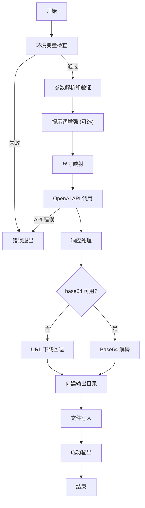

# AI 图像生成 Skill 规格说明（仅用来了解处理过程，不会按照这个文档的逻辑编写Skill，我要写的Skill处理逻辑不一样）

## 1. 概述

### 1.1 目的

本 Skill 实现基于 OpenAI `gpt-image-1` 模型的 AI 图像生成功能，为用户提供通过文本描述创建高质量艺术图像的能力，支持多种宽高比和艺术风格主题。

### 1.2 触发条件

当用户出现以下需求时激活此 Skill：
- 从文本描述生成图像或创作艺术作品
- 指定特定艺术风格（如吉卜力、未来主义、皮克斯、油画、水墨画等）
- 需要特定宽高比的图像（竖向、横向、方形）
- 提及 AI 图像生成、DALL-E 或类似图像生成服务

## 2. 输入参数规格

Skill 接收以下参数，所有参数均有明确的类型和默认值定义：

```json
{
  "skill_parameters": {
    "prompt": {
      "type": "string",
      "required": true,
      "description": "图像生成的文本描述，支持自然语言表达视觉内容、风格、氛围等",
      "example": "a cat sitting on a tree branch, surrounded by cherry blossoms"
    },
    "style": {
      "type": "string",
      "required": false,
      "default": "square",
      "description": "图像宽高比，决定生成的画幅比例",
      "allowed_values": ["vertical", "horizontal", "square"],
      "example": "horizontal"
    },
    "theme": {
      "type": "string",
      "required": false,
      "default": null,
      "description": "艺术风格主题，用于增强提示词以产生特定的艺术效果",
      "allowed_values": ["ghibli", "futuristic", "pixar", "oil-paint", "chinese-paint"],
      "example": "ghibli"
    },
    "output": {
      "type": "string",
      "required": false,
      "default": "./generated_image.png",
      "description": "输出图像文件的完整路径或相对路径",
      "example": "./artwork/sunset.png"
    }
  }
}
```

### 2.1 参数详细说明

#### prompt (必需)

用户对目标图像的自然语言描述。这是图像生成的核心输入，应该描述：
- 主要视觉元素和对象
- 场景设定和环境
- 情绪氛围和风格倾向

#### style (可选)

图像的宽高比配置，映射关系如下：

| style 值 | OpenAI 尺寸 | 比例说明 | 适用场景 |
|----------|-------------|----------|----------|
| `vertical` | 1024x1536 | 2:3 竖向 | 肖像、海报、手机壁纸 |
| `horizontal` | 1536x1024 | 3:2 横向 | 横幅、风景、桌面壁纸 |
| `square` | 1024x1024 | 1:1 方形 | 社交媒体头像、图标 |

#### theme (可选)

预定义的艺术风格主题，每个主题对应特定的提示词增强字符串：

- `ghibli`: 吉卜力动画风格，异想天开、梦幻、柔和色彩、手绘美学
- `futuristic`: 科幻风格，流线型设计、霓虹灯、先进技术
- `pixar`: 鲜艳的 3D 动画风格，富有表现力的角色、精致渲染
- `oil-paint`: 古典油画，丰富的纹理、可见的笔触
- `chinese-paint`: 传统中国水墨画，精致的笔法、空灵的意境

#### output (可选)

图像输出路径，支持相对路径和绝对路径。如果父目录不存在，Skill 应自动创建。

## 3. 系统规则

### 3.1 环境约束 (environment_constraint)

执行此 Skill 前必须满足以下环境要求：

**必需的环境变量**：
- `OPENAI_API_KEY`: OpenAI API 密钥，必须有访问 `gpt-image-1` 模型的权限

**Python 版本要求**：
- Python ≥3.12

**设计动机**：`gpt-image-1` 模型需要组织验证的 API 密钥，且现代 Python 特性确保代码的类型安全和性能。

### 3.2 输出约束 (output_constraint)

生成的图像必须：
- 保存到用户指定的 `{output}` 路径
- 保持原始图像数据的完整性（base64 解码或 HTTP 下载）
- 如果输出目录不存在则自动创建（使用 `mkdir -p` 语义）

### 3.3 API 约束 (api_constraint)

与 OpenAI API 交互时必须遵守：
- 使用 `gpt-image-1` 模型
- 支持的尺寸：`1024x1024`、`1024x1536`、`1536x1024`
- 响应格式优先级：`b64_json` > `url`
- 每次请求只生成一张图像 (`n=1`)

## 4. 执行流程

### 4.1 流程概览



### 4.2 详细执行步骤

#### 步骤 1: 环境变量验证

检查 `OPENAI_API_KEY` 是否设置：

```python
api_key = os.getenv("OPENAI_API_KEY")
if not api_key:
    # 显示错误信息并退出
    # 错误信息应指导用户如何设置环境变量
    sys.exit(1)
```

**错误处理**：如果 API 密钥未设置，显示清晰的错误消息和设置说明，以退出码 1 终止执行。

#### 步骤 2: 参数处理

**提示词增强**：
如果用户指定了 `{theme}` 参数，将主题描述附加到原始提示词：

```python
# 伪代码示例
if theme is not None and theme in THEMES:
    enhanced_prompt = f"{prompt}, {THEMES[theme]}"
else:
    enhanced_prompt = prompt
```

**尺寸映射**：
将用户友好的 style 名称映射到 OpenAI API 所需的尺寸字符串：

```python
# 映射关系
SIZE_MAP = {
    "vertical": "1024x1536",
    "horizontal": "1536x1024", 
    "square": "1024x1024"
}
size = SIZE_MAP[style]
```

#### 步骤 3: API 调用

使用 OpenAI Python SDK 发起图像生成请求：

```python
# 伪代码示例
client = OpenAI(api_key=api_key)
response = client.images.generate(
    model="gpt-image-1",
    prompt=enhanced_prompt,
    size=size,
    n=1
)
```

**用户反馈**：在 API 调用前向用户显示当前请求的信息（提示词、尺寸），让用户了解正在执行的操作。

#### 步骤 4: 响应处理

处理 API 响应，获取图像数据：

```python
# 伪代码示例：响应处理逻辑
if response.data[0].b64_json exists and not empty:
    # 主要路径：gpt-image-1 通常返回 base64
    image_data = base64_decode(response.data[0].b64_json)
else if response.data[0].url exists and not empty:
    # 回退路径：处理 URL 格式
    image_data = http_get(response.data[0].url)
else:
    raise Exception("No image data received")
```

**设计动机**：优先使用 base64 格式，因为它是 `gpt-image-1` 的主要响应格式，且不依赖网络下载稳定性。

#### 步骤 5: 文件系统操作

**目录创建**：
确保输出路径的父目录存在：

```python
# 伪代码示例
output_path = Path(output)
output_path.parent.mkdir(parents=True, exist_ok=True)
```

**文件写入**：
将图像数据写入指定路径：

```python
# 伪代码示例
with open(output_path, "wb") as f:
    f.write(image_data)
```

#### 步骤 6: 用户反馈

显示成功信息，包括：
- 确认图像生成成功
- 输出文件的绝对路径
- 如果 API 返回了修订后的提示词 (`revised_prompt`)，也一并显示

### 4.3 错误处理策略

#### 环境错误

**错误类型**：API 密钥未设置或无效
**处理方式**：
- 显示友好的错误消息，说明问题原因
- 提供设置环境变量的具体命令
- 以退出码 1 终止执行

#### API 错误

**错误类型**：网络问题、API 限流、配额不足、权限问题等
**处理方式**：
- 捕获所有 OpenAI API 异常
- 显示用户友好的错误信息（避免暴露技术细节）
- 以退出码 1 终止执行

#### 文件系统错误

**错误类型**：写入权限不足、磁盘空间不足等
**处理方式**：
- 捕获文件操作异常
- 显示具体的错误信息和可能的解决建议
- 以退出码 1 终止执行

## 5. 核心数据结构

### 5.1 风格配置映射

```python
STYLES = {
    "vertical": "1024x1536",   # 2:3 比例，竖向
    "horizontal": "1536x1024", # 3:2 比例，横向
    "square": "1024x1024"      # 1:1 比例，方形（默认）
}
```

### 5.2 主题增强配置

```python
THEMES = {
    "ghibli": "in the style of Studio Ghibli animation, whimsical and dreamlike with soft colors and hand-drawn aesthetic",
    "futuristic": "in a futuristic sci-fi style with sleek designs, neon lights, and advanced technology",
    "pixar": "in Pixar animation style with vibrant colors, expressive characters, and polished 3D rendering",
    "oil-paint": "as an oil painting with rich textures, visible brushstrokes, and classical artistic composition",
    "chinese-paint": "in traditional Chinese ink painting style with delicate brushwork, minimalist composition, and ethereal atmosphere"
}
```

**设计说明**：
- 每个主题字符串设计为可附加到用户提示词后面
- 使用逗号分隔，保持自然语言流畅性
- 描述词汇选择经过优化，能有效引导模型产生对应风格

## 6. 依赖和环境

### 6.1 Python 依赖

```toml
[project]
dependencies = [
    "click>=8.3.0",    # CLI 框架，用于命令行界面
    "openai>=2.7.1",   # OpenAI API 客户端
]
```

**依赖说明**：
- **Click**: 提供命令行参数解析、用户交互和终端输出美化
- **OpenAI**: 提供 `gpt-image-1` 模型的访问接口

### 6.2 运行时要求

- **Python 版本**: ≥3.12
- **包管理器**: uv (推荐) 或 pip
- **API 访问**: OpenAI API 密钥，且组织已通过验证

### 6.3 技术架构

```
┌─────────────────────────────────────────┐
│         CLI 界面层 (Click)                │
│  参数解析 | 验证 | 用户交互 | 输出美化    │
└─────────────────────────────────────────┘
                    ↓
┌─────────────────────────────────────────┐
│         应用逻辑层                        │
│  提示词增强 | 尺寸映射 | 流程编排         │
└─────────────────────────────────────────┘
                    ↓
┌─────────────────────────────────────────┐
│         API 集成层 (OpenAI SDK)           │
│  gpt-image-1 调用 | 响应解析             │
└─────────────────────────────────────────┘
                    ↓
┌─────────────────────────────────────────┐
│         数据处理层                         │
│  Base64 解码 | HTTP 下载 | 文件写入       │
└─────────────────────────────────────────┘
```

## 7. 实现要点

### 7.1 CLI 设计建议

使用 Click 框架时的关键设计点：

1. **参数验证**: 使用 `click.Choice()` 限制 style 和 theme 的可选值
2. **大小写不敏感**: 设置 `case_sensitive=False` 提升用户体验
3. **默认值显示**: 使用 `show_default=True` 在帮助文本中显示默认值
4. **用户反馈**: 使用 `click.echo()` 和 `click.style()` 提供彩色终端输出

### 7.2 错误处理原则

- **快速失败**: 在执行昂贵的 API 调用前验证所有前置条件
- **用户友好**: 错误信息应清晰说明问题和解决方法，避免技术术语
- **一致性**: 所有错误都应以退出码 1 终止，成功时以退出码 0 正常退出

### 7.3 提示词工程

主题增强字符串的设计考虑：
- 使用逗号分隔，保持提示词的自然语言流畅性
- 包含足够的描述性关键词以引导模型产生期望风格
- 避免过于冗长，保持提示词的简洁性

### 7.4 响应处理策略

优先级顺序：
1. **首选**: `b64_json` - `gpt-image-1` 的主要格式，无网络依赖
2. **回退**: `url` - 兼容性考虑，处理可能的 URL 响应
3. **失败**: 都不存在时抛出异常

## 8. 边界情况和特殊处理

### 8.1 特殊字符处理

用户提示词可能包含特殊字符（如引号、emoji、& 符号等），应：
- 在 CLI 层面正确传递（Click 自动处理）
- 在 API 调用时保持原样传递（OpenAI SDK 自动编码）

### 8.2 长提示词处理

对于很长的提示词：
- OpenAI API 有自己的长度限制和截断策略
- Skill 层面无需额外处理，让 API 返回相应的错误信息

### 8.3 并发生成

如果用户同时发起多个生成请求：
- 每个 Skill 执行实例是独立的
- API 限流由 OpenAI 服务端处理
- Skill 应正确处理 429 (Too Many Requests) 错误

### 8.4 输出路径处理

- 相对路径: 相对于当前工作目录解析
- 绝对路径: 直接使用
- 不存在的目录: 自动创建（使用 `mkdir -p` 语义）

## 9. 验证标准

### 9.1 功能验证

- [ ] 能正确处理所有必需和可选参数
- [ ] 所有 style 选项都能正确映射到对应尺寸
- [ ] 所有 theme 选项都能正确增强提示词
- [ ] 输出文件正确保存到指定路径
- [ ] 不存在的输出目录能自动创建

### 9.2 错误处理验证

- [ ] API 密钥未设置时显示清晰的错误信息
- [ ] API 错误（网络、限流、权限）能正确捕获和处理
- [ ] 无效的参数值能被 Click 自动拒绝
- [ ] 文件系统错误能优雅处理

### 9.3 用户体验验证

- [ ] 帮助信息清晰完整
- [ ] 进度反馈及时准确
- [ ] 错误信息友好且可操作
- [ ] 默认值合理且适用性广

---

**SPEC 版本**: 1.0  
**创建日期**: 2025-01-16  
**兼容性**: Claude Code、Python 3.12+、OpenAI gpt-image-1  
**用途**: 交付给 /skill-creator 用于创建 ai-image skill
